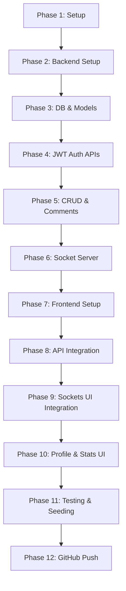

# CommSphere 🌐 | Community Discussion Forum & Real-Time Chat

CommSphere is a premium, responsive Full-Stack MERN (MongoDB, Express, React, Node.js) web application that merges structured, persistent community discussion threads with synchronous, real-time instant messaging channels powered by Socket.IO.

Designed as a high-fidelity proof-of-work project, it showcases core software engineering capabilities like JWT authorization, WebSockets communication, schema design, database indexing, cascading deletes, and modular UI components styled using Tailwind CSS v4.

---

## 🎯 1. Project Explanation

### Simple Explanation (For non-technical stakeholders)
Imagine a platform that combines the structured organization of **Reddit** (where people create topics and write long, persistent comments) with the real-time interaction of **Discord** (where online members can chat instantly). CommSphere does exactly that! Users register, create discussion topics, read or comment on posts, and dynamically toggle into a live chat room to converse in real-time with other users online in that topic room.

### Technical Explanation (For engineering interviewers)
CommSphere is a real-time collaborative forum. It solves the **latency and context gap** in traditional discussion platforms by implementing dual-layer client communication:
1. **Unicast/Multicast HTTP REST Layer**: Handled via Express/Node.js, dealing with persistent CRUD data (User Auth, Discussion Thread creation, persistent Forum replies) stored in MongoDB.
2. **WebSocket TCP Duplex Layer**: Handled via Socket.IO, maintaining active socket rooms per discussion ID. This facilitates sub-second state broadcasts (messages, online participant lists, and visual typing states) between connected clients.

```
[User Registration] ➔ [Login & JWT Issuance] ➔ [Browse/Filter Dashboard]
       │                                                 │
       ▼                                                 ▼
[Create Discussion Thread]                      [Open Discussion Detail]
                                                         │
                                        ┌────────────────┴────────────────┐
                                        ▼                                 ▼
                             [Mode A: Forum Replies]           [Mode B: Socket.IO Live Chat]
                             (REST CRUD Comments)              (Real-time room broadcasts)
```

---

## 💻 2. Tech Stack Options

| Component | Option A: Easy | Option B: Intermediate (Chosen) | Option C: Advanced |
| :--- | :--- | :--- | :--- |
| **Frontend** | HTML + CSS + JS (jQuery) | **React.js + Tailwind CSS v4** | Next.js + Tailwind CSS + TypeScript |
| **Backend** | Firebase / Express + Nedb | **Node.js + Express.js** | NestJS + TypeScript |
| **Real-Time**| Short Polling | **Socket.IO (WebSockets)** | WebRTC / Centrifugo |
| **Database** | LocalStorage / JSON files | **MongoDB + Mongoose** | PostgreSQL + Prisma ORM |
| **Security** | Session Cookies | **JWT + bcryptjs Hashing** | Auth0 / OAuth2.0 / JWT rotation |

### Why Option B is Best for Students:
* **Industry Standard**: React + Node + Mongo is the most sought-after full-stack portfolio stack.
* **Granular Control**: Building auth and socket handlers manually (instead of utilizing Firebase) teaches core TCP/HTTP protocols, token structures, and database optimization.

---

## 📐 3. Project Architecture

### System Architecture Diagram
```
                     ┌─────────────────────────────────────────┐
                     │           Client Browser (React)        │
                     └────┬───────────────────────────────▲────┘
                          │ HTTP REST Requests            │ WebSocket Events
                          │ (Auth, CRUD, Comments)        │ (Chat, Typing, Active list)
                          ▼                               │
              ┌───────────────────────┐       ┌───────────┴───────────┐
              │  Express.js Server    │       │   Socket.IO Server    │
              └───────────┬───────────┘       └───────────▲───────────┘
                          │ Mongoose queries              │
                          ▼                               │
              ┌───────────────────────────────────────────┴───────────┐
              │           Database Engine (MongoDB Atlas)            │
              │  Collections: Users, Discussions, Comments, Messages  │
              └───────────────────────────────────────────────────────┘
```

### Data & Socket Flows
* **Auth Flow**: Client posts credentials ➔ Server checks database & hashes ➔ Returns signed JWT payload ➔ Client caches token in `localStorage` and appends to all request headers.
* **Socket Room Flow**: User opens Discussion Detail Page ➔ Client emits `join_room` with token payload ➔ Server socket joins room ID, updates room's user list Map, fetches 50 recent messages, and broadcasts active status.
* **Database Flow**: Deleting a discussion triggers cascading deletes on all comments and messages linked to that thread ID.

---

## 🛠️ 4. Implementation Plan



### Phase-wise Checklist

1. **Phase 1: Setup & Dependencies**
   * *Tasks*: Initialize folders, write server `package.json`, install NPM packages, configure `.env`.
   * *Expected Output*: Clean environment with all modules installed.
   * *Mistake to Avoid*: Committing the `.env` secret file to git.

2. **Phase 2: Database & Models**
   * *Tasks*: Setup `db.js` connector, write User, Discussion, Comment, and Message mongoose schemas.
   * *Expected Output*: Successful MongoDB connection logs on startup.
   * *Mistake to Avoid*: Missing relational references (`ref: 'User'`) in models.

3. **Phase 3: JWT Authentication**
   * *Tasks*: Implement bcrypt password pre-save middleware, register, and login routes. Write auth validation middlewares.
   * *Expected Output*: Secure generation and decoding of token headers.
   * *Mistake to Avoid*: Storing passwords in plain-text inside database.

4. **Phase 4: Discussion CRUD & Comments**
   * *Tasks*: Write routes for creating, listing, searching, filtering, and deleting discussions and comments.
   * *Expected Output*: Checked endpoints using REST client tools.
   * *Mistake to Avoid*: Forgetting cascading deletions of messages and comments when deleting discussions.

5. **Phase 5: Socket.IO Server Setup**
   * *Tasks*: Bind Socket.IO to HTTP server, write room handlers for joining, leaving, message transmission, and typing status.
   * *Expected Output*: Server socket listeners responding to incoming connections.
   * *Mistake to Avoid*: Forgetting to restrict socket operations to registered room rooms.

6. **Phase 6: Frontend React Setup**
   * *Tasks*: Scaffolding with Vite, installing Tailwind CSS v4, setup React Router navigation.
   * *Expected Output*: Single Page Application rendering responsive views.
   * *Mistake to Avoid*: Ad-hoc CSS stylings instead of modular Tailwind configurations.

7. **Phase 7: Auth & Forms UI**
   * *Tasks*: Build register and login screens with client-side field validation.
   * *Expected Output*: User registration and token storage.
   * *Mistake to Avoid*: Storing credentials in local state variables without password masks.

8. **Phase 8: Dashboard & Topic Creation**
   * *Tasks*: Design community listing feed, search box, category filters, and new discussion editor.
   * *Expected Output*: Populated feed with live search filtering.
   * *Mistake to Avoid*: Fetching excessive fields instead of using lean populations.

9. **Phase 9: Chat & Socket Integration**
   * *Tasks*: Integrate socket connection hooks, handle message history loading, typing indicators, and user lists.
   * *Expected Output*: Instant messaging sync between two browser tabs.
   * *Mistake to Avoid*: Duplicate socket listeners causing memory leaks (cleanup listeners on unmount!).

10. **Phase 10: User Profile & Visual Polish**
    * *Tasks*: Build profile update panel, avatar custom color theme toggles, and statistics widgets.
    * *Expected Output*: Dynamic avatars reflecting color settings.
    * *Mistake to Avoid*: Broken route links when returning from nested folders.

11. **Phase 11: Virtual Seeding & Simulation**
    * *Tasks*: Run seeder script, test edge cases (invalid logins, empty chats, deleting threads).
    * *Expected Output*: Database populated with pre-made mock conversations.
    * *Mistake to Avoid*: Hardcoding credentials in script files.

12. **Phase 12: GitHub Submission**
    * *Tasks*: Write README.md, structure `.gitignore`, push code, verify documentation links.
    * *Expected Output*: Professional open-source repository.
    * *Mistake to Avoid*: Messy folder structures without descriptions.

---

## 📂 5. Folder Structure

```
Community-Discussion-Forum-RealTime-Chat/
│
├── client/                     # Frontend SPA Client
│   ├── public/                 # Static asset folders
│   ├── src/
│   │   ├── assets/             # Images and styles
│   │   ├── components/         # Reusable UI widgets
│   │   │   ├── Navbar.jsx      # Navigation bar
│   │   │   ├── Sidebar.jsx     # Filters and tags panel
│   │   │   ├── CommentSection.jsx  # Forum comments thread controller
│   │   │   └── RealtimeChatSection.jsx # Socket.IO live chat workspace
│   │   ├── pages/              # Main routing views
│   │   │   ├── Dashboard.jsx   # Discussion list feed
│   │   │   ├── Login.jsx       # Login form
│   │   │   ├── Register.jsx    # Signup form
│   │   │   ├── CreateDiscussion.jsx # Create topic form
│   │   │   ├── DiscussionDetail.jsx # Thread detail page
│   │   │   └── Profile.jsx     # Profile configuration
│   │   ├── services/
│   │   │   └── api.js          # REST Client API fetch hooks
│   │   ├── sockets/
│   │   │   └── socket.js       # Client Socket.IO manager
│   │   ├── index.css           # Tailwind CSS directives
│   │   ├── main.jsx            # React root script
│   │   └── App.jsx             # Main router configuration
│   ├── index.html              # Document entry point
│   ├── vite.config.js          # Vite config with tailwind plugin
│   └── package.json            # Frontend config files
│
├── server/                     # Node Backend Server
│   ├── config/
│   │   └── db.js               # MongoDB Mongoose connector
│   ├── controllers/
│   │   ├── authController.js   # Auth handler controllers
│   │   ├── commentController.js # Comment handler controllers
│   │   └── discussionController.js # Discussion handler controllers
│   ├── middleware/
│   │   └── authMiddleware.js   # JWT Auth Validation middleware
│   ├── models/
│   │   ├── User.js             # Mongoose User Schema
│   │   ├── Discussion.js       # Mongoose Discussion Schema
│   │   ├── Comment.js          # Mongoose Comment Schema
│   │   └── Message.js          # Mongoose Live Chat Schema
│   ├── routes/
│   │   ├── authRoutes.js       # Authentication router
│   │   ├── commentRoutes.js    # Comment router
│   │   └── discussionRoutes.js # Discussion router
│   ├── sockets/
│   │   └── chatSocket.js       # Socket.IO Event coordinator
│   ├── .env                    # Environment local secrets
│   ├── .env.example            # Environment template config
│   ├── seed.js                 # Seeder script for mock data
│   ├── server.js               # Main Express HTTP & Socket bootstrap
│   └── package.json            # Backend config files
│
├── .gitignore                  # Git tracking rules
└── README.md                   # Repository Documentation
```

---

## 🚀 6. Installation & Execution Guide

### Prerequisite Checklist
* **Node.js** installed (v16.x or higher)
* **MongoDB Community Server** running locally, or a **MongoDB Atlas** cloud cluster URI.

### Step-by-Step Server Setup
1. Open terminal and navigate to server folder:
   ```bash
   cd server
   ```
2. Install npm dependencies:
   ```bash
   npm install
   ```
3. Configure your local environmental values in `.env` file (copy from `.env.example`).
4. Seed the database with mock discussion data:
   ```bash
   npm run seed
   ```
5. Start backend development server:
   ```bash
   npm run dev
   ```
   * *Expected Logs*: `MongoDB Connected: 127.0.0.1` and `Server running in development mode on port 5000`.

### Step-by-Step Client Setup
1. Open a new terminal tab and navigate to client folder:
   ```bash
   cd client
   ```
2. Install npm dependencies:
   ```bash
   npm install
   ```
3. Boot client development server:
   ```bash
   npm run dev
   ```
   * *Expected Logs*: Local development server link: `http://localhost:5173`.

---

## 🏷️ 7. API Endpoints & Socket Events

### HTTP REST APIs

| HTTP Verb | Endpoint | Authentication | Description |
| :--- | :--- | :--- | :--- |
| **POST** | `/api/auth/register` | Public | Create new user profile, returns JWT |
| **POST** | `/api/auth/login` | Public | Verify credentials, returns JWT |
| **GET** | `/api/auth/profile` | Private (Bearer Token) | Get user profile data |
| **PUT** | `/api/auth/profile` | Private (Bearer Token) | Update profile and color theme settings |
| **POST** | `/api/discussions` | Private (Bearer Token) | Create new forum discussion topic |
| **GET** | `/api/discussions` | Public | Fetch topics (supports filters `category, tag, search`) |
| **GET** | `/api/discussions/:id`| Public | Fetch detailed single topic info |
| **PUT** | `/api/discussions/:id`| Private (Creator Only) | Edit title, category, description, and tags |
| **DELETE**| `/api/discussions/:id`| Private (Creator Only) | Cascading delete topic, comments, and messages |
| **POST** | `/api/comments` | Private (Bearer Token) | Post reply to a discussion thread |
| **GET** | `/api/comments/discussion/:id` | Public | Fetch replies chronologically |
| **DELETE**| `/api/comments/:id` | Private (Creator Only) | Remove a user comment reply |

### Socket.IO Real-time Events

| Event Name | Type | Payload Structure | Trigger / Handler |
| :--- | :--- | :--- | :--- |
| `join_room` | Emit (Client) | `{ discussionId, userId, username, avatarColor }` | Invoked on mount. Joins room, loads history, updates online users. |
| `message_history` | Listen (Client)| `[ { sender: {...}, content, createdAt } ]` | Receives last 50 room messages to populate screen logs on join. |
| `send_message` | Emit (Client) | `{ discussionId, senderId, content }` | Sends typed message string. Saved to DB and broadcasted. |
| `receive_message`| Listen (Client)| `{ sender: {...}, content, createdAt }` | Adds incoming broadcast chat bubble to message window. |
| `typing` | Emit (Client) | `{ discussionId, username, isTyping }` | Sends client keystroke status to room. |
| `user_typing` | Listen (Client)| `{ username, isTyping }` | Renders dynamic typing anim text if active. |
| `room_users` | Listen (Client)| `[ { username, avatarColor, socketId } ]` | Refreshes right-hand online users sidebar pane. |
| `leave_room` | Emit (Client) | `{ discussionId, userId }` | Invoked on unmount. Cleans user from active maps. |

---

## 🧪 8. Virtual Simulation Flow

To simulate a real community environment in your local machine:
1. **Prepare Browser Tabs**: Open two side-by-side browser windows in Incognito mode:
   * Window A: Login as `alex_merner` (alex@example.com / password123).
   * Window B: Login as `sophia_designer` (sophia@example.com / password123).
2. **Browse Feed**: Observe the seeded discussions on the main page.
3. **Filter and Search**: Click on the "Programming" category or type "Socket.IO" into the search bar. Observe the filtered thread items.
4. **Open Detail**: Both tabs open the discussion topic: *"How to manage Socket.IO reconnections..."*.
5. **Forum Commenting**:
   * Sophia writes a comment under the **Forum Discussion** tab.
   * Reloading or opening the page shows the persistent replies updated.
6. **Dynamic Toggle**: Both users switch tabs to the **Live Chat Room** tab.
7. **Real-time Synchronization**:
   * Observe active members appearing in the right-hand panel of both windows.
   * John begins typing in Window A. Observe Sophia's tab showing *"alex_merner is typing..."* animation.
   * Send a chat message in Window A. Observe the message arriving instantly in Window B's chat log without reloading.
8. **Cascading Delete (Optional)**: Log in as Sophia (the creator of that topic). Click `Delete Topic`. Observe redirect. Verify that the discussion and its replies are wiped from MongoDB Atlas or your local MongoDB dashboard.

---

## 📈 9. Day-wise Proof Building Strategy

Follow this plan to compile a high-value GitHub history. Run git commits sequentially at the end of each daily milestone.

* **Day 1: Project Skeleton Initialization**
  * *Code built*: Scaffolding client with Vite, server configs, package.json dependencies, and gitignore.
  * *Git Command*: `git commit -m "feat: setup project directories, environment files, and install dependencies"`
  * *Screenshot*: Terminal showing npm installation completion.

* **Day 2: MongoDB Connection and Schema Designs**
  * *Code built*: `server/config/db.js`, User, Discussion, Comment, and Message models.
  * *Git Command*: `git commit -m "feat: design schema models for User, Discussion, Comment, and Message collections"`
  * *Screenshot*: Mongo Shell (`mongosh`) or Compass showing database connection configuration.

* **Day 3: Authentication Route Handlers**
  * *Code built*: JWT generation, hashing methods in User model, protect middlewares, login and registration APIs.
  * *Git Command*: `git commit -m "feat: implement JWT authentication, password hashing, and user profile endpoints"`
  * *Screenshot*: REST client tests showing a register query returning a valid JWT token.

* **Day 4: Discussion CRUD & Comment Engines**
  * *Code built*: CRUD controller logic for discussions and comments; cascading deletes logic.
  * *Git Command*: `git commit -m "feat: implement discussion CRUD and comment submission APIs with cascade deletes"`
  * *Screenshot*: Database collections showing comments and discussions in sync.

* **Day 5: Socket.IO Server Setup**
  * *Code built*: HTTP server integration, socket routing wrapper, room handlers, and typing listeners.
  * *Git Command*: `git commit -m "feat: configure socket server room join, messaging, and typing handlers"`
  * *Screenshot*: Node console logs showing server initializing websockets.

* **Day 6: Client Router and Auth Screens**
  * *Code built*: React Router, tailwind v4 base stylings, Register and Login forms UI.
  * *Git Command*: `git commit -m "feat: setup client routing, state management, register, and login UI panels"`
  * *Screenshot*: Login page design in browser.

* **Day 7: Client Discussion Board Feed**
  * *Code built*: Dashboard layout, Sidebar filters by category and tag, search query listeners, and CreateTopic form.
  * *Git Command*: `git commit -m "feat: build dashboard community feed, filter widgets, and topic creation form"`
  * *Screenshot*: Dashboard showing seeded posts.

* **Day 8: Socket.IO Frontend Integration**
  * *Code built*: Client sockets configuration, real-time message feed, typing indicator anims, and room user sidebars.
  * *Git Command*: `git commit -m "feat: integrate socket.io client, live chat room interface, typing indicators, and active users"`
  * *Screenshot*: Dual-window browser view showcasing real-time chat sync.

* **Day 9: Final Polish, Profiles and seeding**
  * *Code built*: Profile edit panel, seeder scripts, visual toast notifications, and UI cleanup.
  * *Git Command*: `git commit -m "feat: build profile configs, seeder script, and add global toast notifications"`
  * *Screenshot*: Final responsive layout.

---

## 📷 10. Core Screenshots to Capture

For your GitHub portfolio, make sure to add these screenshots inside a folder named `/docs/screenshots`:
1. **`01_register_page.png`**: Register panel showing custom avatar color pickers.
2. **`02_login_page.png`**: Sleek login card showing error alerts on bad input.
3. **`03_dashboard_feed.png`**: Full dashboard displaying categorized discussions, tags cloud, search bar, and post counters.
4. **`04_create_discussion.png`**: Form for creating discussions.
5. **`05_forum_discussion_mode.png`**: Discussion details page on the "Forum Discussion" tab showcasing threaded persistent replies.
6. **`06_live_chat_mode.png`**: "Live Chat Room" view showing message logs, active users list on the right, and typing indicator alerts.
7. **`07_profile_settings.png`**: User profile screen updating bio and color codes.
8. **`08_database_compass.png`**: MongoDB Compass listing the structured tables.

---

## 💬 11. Technical Interview Q&A (Proof of Work Prep)

Here are the top 10 interview questions you might face, accompanied by their HR and Technical explanations:

### Q1: Can you explain your project?
* **HR Explanation**: I built a full-stack real-time discussion forum called CommSphere. It solves the communication gap on typical platforms by combining organized discussion threads (like Reddit) with instantaneous live chat channels (like Discord) for every topic. This project demonstrates my skills in designing complete database systems, securing user records, and managing real-time websocket environments.
* **Technical Explanation**: CommSphere is a decoupled MERN stack application built using React and Node.js. It features a two-tiered communication layer: a standard REST API mapping user management and forum comments to a MongoDB database, and a TCP WebSockets layer managed via Socket.IO. The websocket service handles room partitioning (using thread object IDs as room rooms) to keep track of active members, broadcast typing updates, and route live messages. It features cascade delete hooks in MongoDB, index optimization on relational IDs, and memory leak preventions on the client using react lifecycle hooks.

### Q2: Why did you choose WebSockets (Socket.IO) instead of REST polling for the chat feature?
* **HR Explanation**: Using standard APIs would require the client to continually check the server for new messages every few seconds, which is slow and wastes resources. WebSockets open a direct, open channel for instant communication, allowing messages to arrive immediately.
* **Technical Explanation**: HTTP REST polling introduces high overhead due to repeated TCP handshakes and HTTP header payloads (often 1KB+ per request) sent over and over, which degrades performance and database query efficiency. Socket.IO utilizes WebSockets to keep a persistent, single TCP connection open. This reduces message latency to sub-second levels and cuts server resource usage. Socket.IO also provides auto-reconnection, packet buffering, and room-based client management out of the box.

### Q3: How do you handle authorization in both REST routes and Socket.IO connections?
* **HR Explanation**: We use secure keys called JSON Web Tokens (JWT). When a user logs in, they receive a ticket stored in their browser. This ticket is checked every time they load sensitive pages or send messages.
* **Technical Explanation**: For HTTP routes, we use a custom `protect` middleware that reads the `Authorization` header, extracts the Bearer token, and verifies it against our `JWT_SECRET`. If valid, it pulls the user record (excluding the password) from MongoDB and attaches it to `req.user`. For socket connections, we pass the token during the client handshake: `io(SOCKET_URL, { auth: { token } })`. The server extracts this token during connection setup to verify the socket identity before allowing room subscription.

### Q4: What is a MongoDB cascading delete and how did you implement it?
* **HR Explanation**: When a topic is deleted by its creator, we need to clean up the database so that orphaned comments or chat messages don't stay behind. This is called cascading delete.
* **Technical Explanation**: When a discussion is deleted by its owner via `DELETE /api/discussions/:id`, we need to prevent data leaks. Inside `deleteDiscussion`, we perform atomic operations using mongoose: `Discussion.deleteOne({ _id: discussion._id })`, followed immediately by `Comment.deleteMany({ discussion: discussion._id })` and `Message.deleteMany({ discussion: discussion._id })`. This ensures all orphaned entities referring to that discussion ID are removed, maintaining data integrity.

### Q5: How do you prevent memory leaks when managing Socket.IO listeners in React?
* **HR Explanation**: If we do not clean up background processes when users navigate away from a chat room, the browser will slow down. I wrote code to automatically stop listening to chat updates when the page is closed.
* **Technical Explanation**: React components can mount and unmount multiple times. If socket event listeners (like `socket.on('receive_message')`) are registered inside a `useEffect` hook without cleanup, multiple listeners accumulate on the same socket instance on every navigation. This triggers duplicate state updates and memory leaks. To prevent this, I returned a cleanup function inside the `useEffect` hook that explicitly calls `socket.off('receive_message')`, `socket.off('room_users')`, etc., to clean up the event bus.

### Q6: How does the typing indicator work under the hood?
* **HR Explanation**: When a user types in the message input box, it alerts the server, which then tells the other users in the chat room to show a loading animation.
* **Technical Explanation**: When the client triggers an `onChange` event in the message input, we emit a `typing` event containing `{ discussionId, username, isTyping: true }`. The backend socket server listens to this event and broadcasts a `user_typing` socket event to other sockets in the same room using `socket.to(discussionId).emit(...)`. To prevent spamming the connection on every keystroke, we use a 2-second timeout (a basic debounce mechanism) to reset the typing status to `false` when typing stops.

### Q7: What are the advantages of MongoDB over relational databases like MySQL for this project?
* **HR Explanation**: MongoDB stores data as documents resembling JavaScript objects, which makes it easy to update the data structure (like adding tags to topics) without having to rewrite the database.
* **Technical Explanation**: MongoDB is a document-oriented database that fits the dynamic nature of discussion threads, which often have flexible parameters. Discussions, Comments, and Messages are represented as JSON-like documents, reducing the need for heavy database join operations. For comments and messages, we can run queries using indexed object IDs, achieving high write performance for chat systems.

### Q8: How did you optimize MongoDB queries for thread details and replies?
* **HR Explanation**: I added database keys called indexes to make fetching comments and chat histories faster, and avoided loading sensitive passwords.
* **Technical Explanation**: We optimized lookup performance by adding index keys in our schema. For instance, in `Message.js`, we defined `index: true` on the `discussion` field: `{ discussion: { type: mongoose.Schema.Types.ObjectId, index: true } }`. This speeds up the retrieval of chat logs from O(N) linear scans to O(log N) indexed searches. We also use `.select('-password')` in the User model populate paths to avoid loading sensitive fields.

### Q9: Why did you use React Router instead of standard browser page loads?
* **HR Explanation**: React Router makes the app feel like a desktop application. Page transitions happen instantly without reloading the browser.
* **Technical Explanation**: React Router enables Single Page Application (SPA) behavior. It updates the URL in the address bar and swaps components dynamically in the DOM without requesting a full page reload from the server. This preserves the local memory state (like active socket connections) and significantly improves the user experience.

### Q10: How would you scale the Socket.IO server to support millions of concurrent users?
* **HR Explanation**: I would deploy multiple instances of the server behind a load balancer and use a Redis database in the middle to synchronize chat messages between them.
* **Technical Explanation**: To scale Socket.IO horizontally across multiple server instances, we face two main challenges: session affinity (handshakes must route to the same server) and message routing (sockets on Server A won't receive events from Server B). To solve this:
  1. Set up a **Load Balancer** (like Nginx or AWS ALB) using **sticky sessions** (IP hash or cookie routing).
  2. Implement the **@socket.io/redis-adapter**. This connects all independent Node server nodes to a central **Redis pub/sub** instance. When Server A broadcasts a message to a room, the Redis adapter forwards it to Servers B and C, ensuring all connected clients receive the message regardless of which server they are connected to.
# CommSphere-Community-Discussion-Forum-Real-Time-Chat

